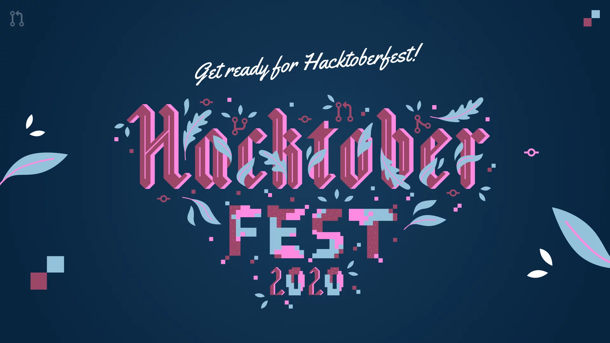

# Hacktoberfest-Project-Ideas

> ### *Instead of just adding your name and email, why not create a list of project ideas?*

We'll organise into different streams here. One kind request for motivation: Please [Subscribe to my **YouTube Channel**](https://www.youtube.com/praveenscience?sub_confirmation=1) and also tell your friends too.

## Front End Ideas

### HTML & CSS

* Responsive Portfolio
* Photography Site
* Technical Documentation Page
* Survey Forms
* Comic Reading Site
* Product Landing Page

### JavaScript

* ToDo App
* Tic Tac Toe Game
* JS Quiz App
* Expense Manager
* Covid CheckUp Test
* Calculator
* Animation in Web Design
* Flappy Bird Game
* Snake Game
* Maze Game
* JavaScript Map
* Tip Calculator
* Color Palette App
* Virtual Drums App
* Dice Roll
* Weather App 
* Hangman Game
* Memory (Card Game)
* Transaction Limiter (Splitwise App Clone)

### React JS

* ToDo App
* Dictionary App (Using Oxford Dictionary Api)
* Weather App
* Recipe search App
* E-commerce app
* Tinder Clone
* AirBnB Clone
* Instagram Clone
* Github Finder
* Movie Listener
* Instagram Clone
* Netflix Clone

## Back End Ideas

### Spring Stack

* Library Managemnet App
* Authorization Server
* Chatting App
* eWallet App
* Online Store App

## Full Stack Ideas

### Generic Stack

* Amazon Clone
* Fashion eCommerce Website
* Food Delivery App

### LAMP Stack

* GuestBook App

### MERN Stack

* User Management System
* Virtual Queue Management System

### Blockchain

* Simple Voting Dapp
* Digital Land Registry System
* Personal Identity System
* Supply Chain Management System
* Cryptocurrency 
* Medical use case - Storing sensitive medical data 

### Python-Django

* Todo App
* Password Generator
* Personal Portfolio
* Stone Paper Scissor
* Palindrome Checker
* Sorting Visualizer
* Reminder System
* Automatic Birthdays Mailer

## Programming Ideas

### C++

* Tic-Tac-Toe Game
* Chess Game
* Library Management System

### Python

* Facial recognition using Python OpenCV library
* Magic 8 Ball
* Ping Pong Game
* 3D AR Draw with Python (OpenCV and NumPy)

## Mobile Applications
* Weather App
* Restaurant App using API
* Expense Tracker App

### Android Studio

* Women Safety App (+Backend)
* Notes App
* Snake Game
* Shopping App (+Backend)
* Flappy Bird
* Service App (Hospital, Business, etc.)
* COVID-19 Tracker
* Daily Expenses App (+Backend)
* Shop App
* Resume Builder App
* News Reader App 
* Voice Notes App

### Flutter

* Menstrual Cycle Tracker (similar to CLUE App)
  > The app which accurately predicts your period,helps women to understand their symptoms, giving enough knowledge about cancer related problems.
* Creating your own music App like Spotify.
* Awesome Cook App
  > The app where you can put already avaliable ingredients at your home and it will provide you with variety of meals you can cook with them.  

## React Native

* Book Rating/Review App (similar to IMDB but for books)
  > We can search about a book (google books/goodreads API) get info about it, with addition of backend we can make a 'TO-READ'/favourites list.

## AI/ML

* Chatbot for Healthcare Management
* Spam Email Detection System
 
## Contribution

1. Star this Repo and Fork this Repo.
2. Update your Readme in your Repo.
3. Send a Pull Request.
4. Optional Request: [Subscribe to my **YouTube Channel**](https://www.youtube.com/praveenscience?sub_confirmation=1).

For a detailed guidance with pictures, see [Contributing to Open Source](https://github.com/CatsInTech/Rezume/blob/master/CONTRIBUTING.md).
